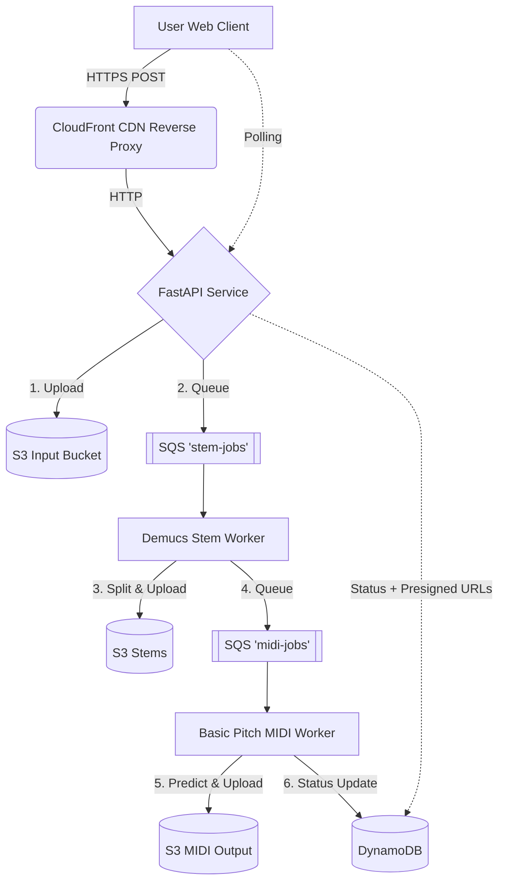

# 🎵 Audio2MIDI Cloud (Decoupled & Well-Architected)

## WAV → Stem Separation → MIDI Conversion Platform

Audio2MIDI Cloud is a cloud-native platform that converts audio files (WAV/MP3) into MIDI files using a distributed, decoupled microservices architecture. It features a modern Web UI hosted globally on AWS CloudFront.

---

## 🚀 Architecture Highlights

The system has been meticulously designed following the **AWS Well-Architected Framework**:

1.  **Frontend & Delivery:** A beautiful, glassmorphism Web UI (`web-client/`) hosted on S3 and distributed globally via a **CloudFront CDN**. It acts as a secure reverse proxy to the backend API, eliminating Mixed Content errors.
2.  **Decoupled Pipeline:** Uses two separate SQS queues (`stem-jobs` and `midi-jobs`) to orchestrate the AI microservices asynchronously, preventing worker contention and timeout crashes.
3.  **Cost Efficiency:** Uses S3 Lifecycle policies (24h deletion) and pay-per-request DynamoDB. Total AWS cost is estimated at ~$20/month.
4.  **Monitoring & Alarms:** Equipped with **CloudWatch Alarms** tied to SNS to email administrators if the monthly bill exceeds $40 or if the CloudFront CDN experiences >5% 5xx Error rates.
5.  **CI/CD Pipeline:** Fully automated deployments using **GitHub Actions**. Pushing to `main` securely authenticates with Docker Hub using repository secrets, builds the multi-architecture images, and pushes them for the Kubernetes cluster to pull.

---

## 🏗 System Workflow



---

## 💰 Monthly Cost Estimation

| Service | Component | Estimated Cost |
| :--- | :--- | :--- |
| **EC2** | `t3a.medium` (4GB RAM) | ~$13.50 |
| **EBS** | 50GB GP3 Storage | ~$4.00 |
| **CloudFront** | Global CDN | $0.00 (Free Tier) |
| **S3** | Storage & Web Hosting | ~$0.50 |
| **SQS** | Messaging | $0.00 (Free Tier) |
| **DynamoDB** | Metadata | $0.00 (Free Tier) |
| **Total** | | **~$18.00 - $20.00** |

---

## 💻 Included Tools

### Web UI
Located in `web-client/`, simply open `index.html` locally or visit your deployed CloudFront URL. It provides drag-and-drop uploads, real-time polling progress bars, and dynamic presigned S3 download buttons.

### Auto Downloader
A Python CLI tool located in `tools/auto_download.py` designed for rapid headless testing:
```bash
python3 tools/auto_download.py <path_to_audio_file>.wav
```
*Automatically uploads, polls, and downloads all 4 returning Stem and MIDI files to a folder in `~/Downloads`.*

---

## 🐳 Deployment Guide

### 1. CI/CD (Recommended)
Simply push to the `main` branch. The `.github/workflows/deploy.yml` pipeline will automatically build and push the `api-service`, `stem-service`, and `midi-service` images to Docker Hub.

*Requires `DOCKERHUB_USERNAME` and `DOCKERHUB_TOKEN` secrets configured in your GitHub repository.*

### 2. Infrastructure

```bash
cd terraform
terraform init
terraform apply
```

### 3. Kubernetes Local Config

Update `k8s/config.yaml` with the outputs from Terraform, then apply to the remote cluster:

```bash
KUBECONFIG=kubeconfig.yaml kubectl apply -f k8s/
```

### 4. Deploy Frontend

```bash
aws s3 sync web-client/ s3://<YOUR_WEB_BUCKET_NAME>
aws cloudfront create-invalidation --distribution-id <YOUR_DISTRIBUTION_ID> --paths "/*"
```

---

## 🛠 Tech Stack
- **Infrastructure:** Terraform, AWS (S3, CloudFront, CloudWatch, SQS, DynamoDB), Kubernetes (k3s on EC2)
- **AI/ML:** Demucs (Meta), Basic Pitch (Spotify)
- **Backend:** Python, FastAPI, Boto3, Docker
- **Frontend:** Vanilla HTML/CSS/JS (Glassmorphism design)
