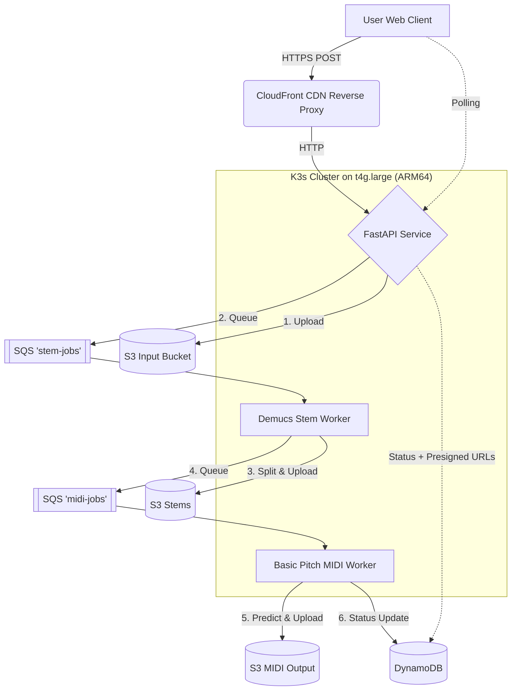

# 🎵 Audio2MIDI Cloud (Decoupled & Well-Architected)

## WAV → Stem Separation → MIDI Conversion Platform

Audio2MIDI Cloud is a cloud-native platform that converts audio files (WAV/MP3) into MIDI files using a distributed, decoupled microservices architecture. It features a modern Web UI hosted globally on AWS CloudFront.

---

## 🚀 Architecture Highlights

The system has been meticulously designed following the **AWS Well-Architected Framework**:

1. **Frontend & Delivery:** A beautiful, glassmorphism Web UI (`web-client/`) hosted on S3 and distributed globally via a **CloudFront CDN**. It acts as a secure reverse proxy to the backend API, eliminating Mixed Content errors.
2. **Decoupled Pipeline:** Uses two separate SQS queues (`stem-jobs` and `midi-jobs`) to orchestrate the AI microservices asynchronously. This prevents API timeouts and allows the heavy AI workloads to process independently.
3. **Cost & Compute Efficiency (Graviton):** Powered by an AWS Graviton `t4g.large` (ARM-based) instance. This provides the necessary 8GB of RAM required by Meta's Demucs and Spotify's Basic Pitch models to prevent Out-Of-Memory (OOM) crashes, while remaining highly cost-effective. Persistent storage costs are minimized using S3 Lifecycle policies (24h deletion) and pay-per-request DynamoDB.
4. **Monitoring & Alarms:** Equipped with **CloudWatch Alarms** tied to SNS to email administrators if the monthly bill exceeds $40 or if the CloudFront CDN experiences >5% 5xx Error rates.
5. **End-to-End CI/CD:** Fully automated deployments using **GitHub Actions**. Pushing to `main` builds multi-architecture (ARM64) Docker images for the backend, applies Kubernetes manifests, and seamlessly syncs/invalidates the S3 + CloudFront frontend.

---

## 🏗 System Workflow



---

## 💰 Monthly Cost Estimation

| Service | Component | Estimated Cost |
| :--- | :--- | :--- |
| **EC2** | `t4g.large` (2 vCPU, 8GB RAM, ARM) | ~$16.50 |
| **EBS** | 50GB GP3 Storage | ~$4.00 |
| **CloudFront** | Global CDN | $0.00 (Free Tier) |
| **S3** | Storage & Web Hosting | ~$0.50 |
| **SQS** | Messaging | $0.00 (Free Tier) |
| **DynamoDB** | Metadata | $0.00 (Free Tier) |
| **Total** | | **~$21.00** |

*Note: Upgrading from a `t3a.medium` (4GB) to a `t4g.large` (8GB) prevents critical OOM worker crashes during Demucs processing. The Graviton (ARM) architecture keeps this upgrade incredibly affordable.*

---

## 💻 Included Tools

### Web UI
Located in `web-client/`, simply open `index.html` locally or visit your deployed CloudFront URL. It provides drag-and-drop uploads, real-time polling progress bars, and dynamic presigned S3 download buttons.

### Auto Downloader
A Python CLI tool located in `tools/auto_download.py` designed for rapid headless testing:
```bash
python3 tools/auto_download.py <path_to_audio_file>.wav
```
*Automatically uploads, polls, and downloads all returning Stem and MIDI files to a folder in `~/Downloads`.*

---

## 🐳 Deployment Guide

### 1. Infrastructure (Terraform)
Provision the AWS infrastructure (VPC, Security Groups, S3, SQS, DynamoDB, and the EC2 instance).
```bash
cd terraform
terraform init
terraform apply
```

### 2. Kubernetes Local Config
Update `k8s/config.yaml` with the outputs from Terraform, then apply to the remote cluster initially (future updates handled by CI/CD):
```bash
KUBECONFIG=kubeconfig.yaml kubectl apply -f k8s/
```

### 3. CI/CD (Fully Automated)
Simply push to the `main` branch. The `.github/workflows/deploy.yml` pipeline will automatically:
- Build and push the `api-service`, `stem-service`, and `midi-service` ARM64 images to Docker Hub.
- Apply the updated Kubernetes manifests.
- Sync the `web-client/` directory to S3 and invalidate the CloudFront cache.

*Requires the following secrets configured in your GitHub repository:*
- `DOCKERHUB_USERNAME`
- `DOCKERHUB_TOKEN`
- `AWS_ACCESS_KEY_ID`
- `AWS_SECRET_ACCESS_KEY`

---

## 🛠 Tech Stack
- **Infrastructure:** Terraform, AWS (S3, CloudFront, CloudWatch, SQS, DynamoDB, EC2 Graviton), Kubernetes (k3s)
- **AI/ML:** Demucs (Meta), Basic Pitch (Spotify)
- **Backend:** Python, FastAPI, Boto3, Docker (ARM64)
- **Frontend:** Vanilla HTML/CSS/JS (Glassmorphism design)
